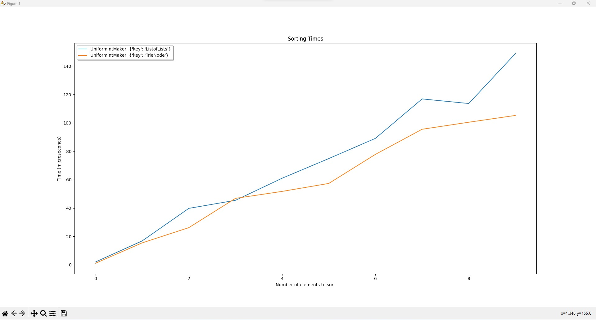
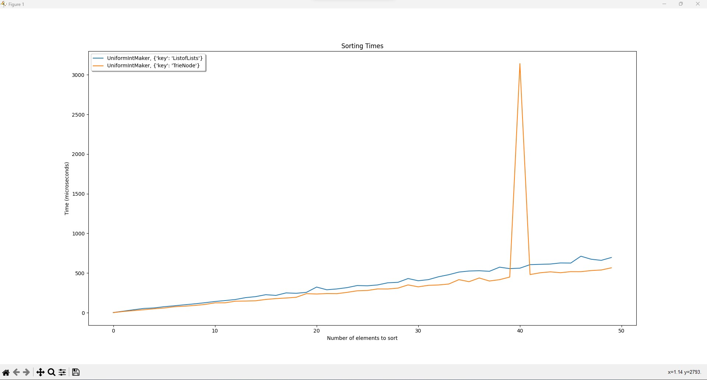
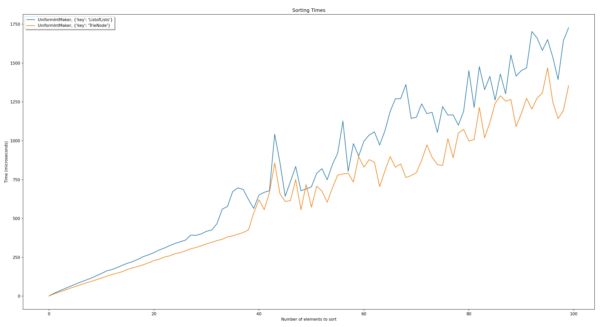
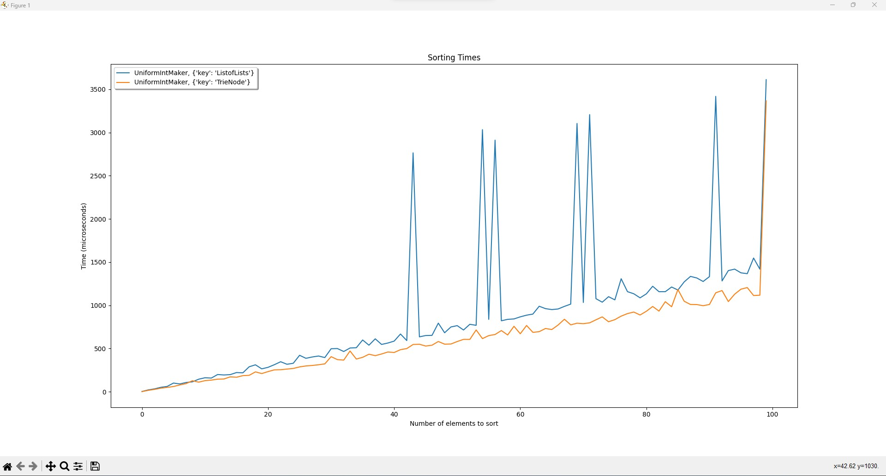
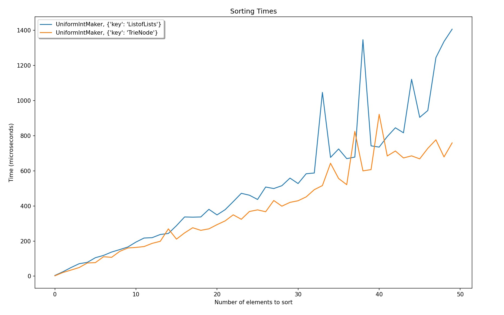

# Sorting Algorithm 
An approach on sorting integers implemented it in two different data structures, trie nodes and list of lists.  
Time complexity comparison of the two data structures using an external library.

Both algorithms implement a custom radix sort, which sorts integers by sorting them digit by digit, starting from the most significant digit. The main difference between the two implementations is the data structure used to store the digits of the integers during the sorting process.  

The TrieNodeSort.py implementation uses a trie data structure to store the digits of the integers. Each node in the trie represents a digit, and the leaves of the trie represent the integers themselves. The algorithm starts by creating a trie for the first digit of each integer, and then continues by adding the remaining digits of each integer to the corresponding nodes of the trie. Once all the digits have been added to the trie, the algorithm retrieves the integers from the leaves of the trie in sorted order.  

The ListofListsSort.py implementation uses a list of lists data structure to store the digits of the integers. Each element in the outer list represents a digit, and the elements of the inner lists represent the integers that have that digit at that position. The algorithm starts by creating a list of empty lists, one for each possible digit. It then adds each integer to the appropriate list based on its first digit. Once all the integers have been added to the lists, the algorithm concatenates the lists to produce the sorted list of integers using an onelist() method.  

Both algorithms have a time complexity of O(kn), where k is the maximum number of digits in the integers and n is the number of integers to be sorted. The ListofListsSort.py implementation has a space complexity of O(kn), while the TrieNodeSort.py implementation has a space complexity of O(n+k).  

TODO  
#utilize numpy library  

  
  
  
  
  
